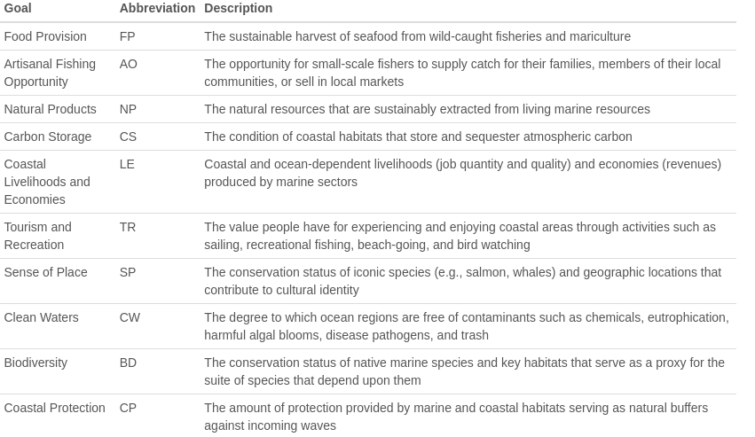
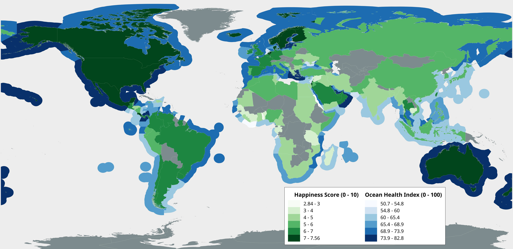
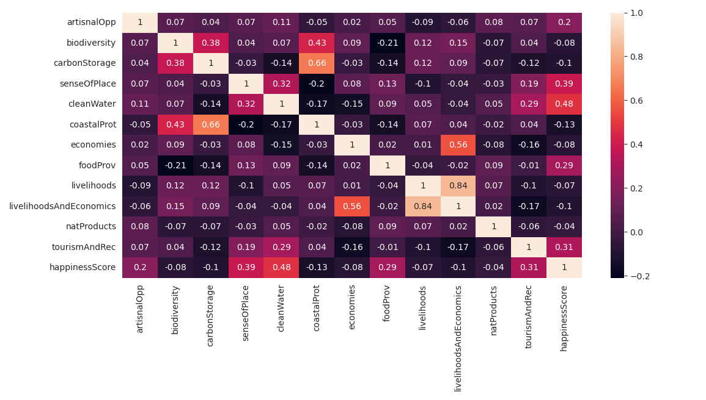

```{r setup, include=FALSE}
knitr::opts_chunk$set(echo = TRUE, warning = FALSE, message = FALSE, fig.cap = TRUE)
library(ggplot2)
library(lme4)
library(lmerTest)
library(tidyverse)
library(magrittr)
library(sjPlot)
library(sjmisc)
library(sjstats)
library(arm)
library(readr)
df <- read_csv("/home/charlie/Documents/Uni/Exeter - Data Science/MTHM601_Fundamentals_of_Applied_Data_Science/assignmentProjectv2/data/cleanData/finalTable.csv")
colours <- list(graphcol = '#315659',
                linecol =   '#253132',
                altlinecol = '#9B2915')
```

\newpage

# Introduction

In a recent paper published in the Journal of Environmental Research and Public Health, Wheaton *et al*. \cite{wheaton_coastal_2021} describes the need for a better understanding of our relationship with the ocean and human wellbeing. The wellbeing benefits of being near or in the ocean have been qualitatively described on an individual or community level \cite{foley_swimming_2015, bell_seeking_2015, burdsey_race_2016} and Wuebben and Gonzalez-Trueba \cite{wuebben_surfing_2019} have identified coastal tourism as having a positive impact on human wellbeing. In addition, 2021 - 2030 has been declared by the United Nations as the 'Decade of Ocean Science for Sustainable Development' \cite{httpsplusgooglecomunesco_united_2017, wheaton_coastal_2021} which highlights how important our relationship to this ecosystem is. However, research also describes the inequity present with regards to access to the ocean, with certain socioeconomic and disadvantaged groups having less availability to the ocean than others \cite{olive_understanding_2021, phoenix_segregation_2021}. Identifying the relationship between the ocean and human wellbeing on a regional or global scale could help to reinforce the importance of protecting coastal ecosystems and help to identify where more work is needed in bringing a sense of connection to the ocean in certain areas.  Therefore, this analysis takes a more quantitative approach and aims to investigate the relationship on a more macro level by exploring how our connection with, and reliance on, the ocean may influence our happiness on a country by country basis.


# Aims and Objectives

The aims of this analysis are to determine whether there is a significant correlation between a countries happiness and the health of the ocean that the country borders. Furthermore, it aims to identify what it is about our connection with the ocean that has the most influence on human wellbeing. To achieve these aims the following objectives need to be achieved: The first step will be to obtain data which include the required information. Since the data is likely to come from different sources, the data need to be cleaned, wrangled and merged together to form one dataset to be used for analysis. This will then allow any missing data to be identified and the appropriate method for handling these data can be applied. From here, descriptive statistics can be carried out to provide more insight into the data. With a better understanding of the features of the dataset a statistical model can then be created to identify any relationship between the features, testing different methodologies to create the most appropraite model for the data. Finally, the results of the analysis will be presented using both visual assets and model outputs followed by discussion around the significance of the results and any limitations of the methods used for analysis. For the data cleaning and wrangling, Python 3.10.2 \cite{10.5555/1593511} will be used, for the statistical analysis, R version 4.1.2 \cite{r_studio} will be used, and for the geographical presentation of the data, QGIS 3.22.3-Białowieża \cite{QGIS_software} will be used.


# Data

For the analysis, multiple datasets were identified as appropriate sources: the Ocean Health Index (OHI) dataset (https://oceanhealthindex.org/global-scores/data-download/) and the World Happiness Report (WHR) dataset (https://www.kaggle.com/unsdsn/world-happiness?select=2019.csv).

## Ocean Health Index

The OHI is a global assessment of 220 countries and assess the health of the ocean within each countries exclusive economic zone (EEZ). The assessment has been conducted from 2012 - 2021 and is still an ongoing project \cite{halpern_index_2012}. The researchers use 10 goals and subgoals that they consider to be an import attributing factor to the health of the ocean for a country. These goals are weighted and used to calculated an overall index score for a country. A description of each goal involved in the calculation of the index score can be seen in Figure \@ref(fig:OHIGoals). In the context of the blue economy and understanding the current status of our oceans, as well as the future threats, the OHI has been beneficial is exploring the link between the indicators of ocean health and the gaps in the research where more data or analysis is need to help protect and improve the state of the global oceans \cite{halpern_building_2020}.

The data set comes in the format of a CSV file and contains an observation for each country for each goal, year and an overall index score. The goals and index are values between 0 - 100 where the index is the weighted calculations of the goals. Since the index is calculated based on the goals, the index was not used in  the analysis and instead each goal was used to determine its influence over the response variable. The data was filtered to only include 2015 - 2019 since this was the data range available in both the WHR and OHI datasets. The data also needed pivoted so that each goal was a column and to tidy the data.

```{r OHIGoals, echo=FALSE, fig.align='center', out.width='75%', fig.cap='The goals and their definitions used to calcualted the index score for each country'}

```


## World Happiness Report

The WHR is a publication by the Sustainable Development Solutions Network and has been published from 2012 - 2021 (excl. 2014). The report synthesis information from the Gallup World Poll and Lloyd's Register Foundation which provides data for the World Risk Poll. The data is collected using qualitative interviews from across 142 countries with a specific focus on ensuring that data is collected in countries where there has traditionally been a lack or of or limited data \cite{noauthor_world_nodate}. The authors of the WHR then synthesize these data add calculate an overall happiness score for each country. There are six factors used to calculate the overall happiness score: GDP per capita, social support, healthy life expectancy, freedom to make life choices, generosity and perceptions of corruption. The format of the data was such that each country had a value for each factor and an overall happiness score. Since the happiness score is a composite index and the values for each factors was the extent to which it influenced the happiness score, the happiness score was used for analysis and considered as the response variable. Each year was its own data set so for each file, a 'year' column was added and all the files were merged into one dataset.

Once a tidy version of the OHI and the WHR had been made containing data for 2015 - 2019, the two datasets needed to be joined together. This was carried out using Pandas in Python and involved some pre-processing steps. The datasets were to be joined using matching values for country and year, however some countries were not consistently named between datasets. These were identified and made consistent then the two datasets were merged. The columns were renamed and ordered in a sensible order to make analysis easier.

To make the world map in Figure \@ref(fig:WHRMap) the shape files of the OHI dataset were used. To this, the cleaned merged dataset was joined to the shape files to allow the ocean health index scores and the world happiness scores to be visualized. QGIS was used for the joining and visualization of this image.

## Missing Data

Missing data was imputed using the `sklearn` package in Python. Two algorithms were used to impute the missing data: K-nearest-neighbour (KNN) and IterativeImputer. Both of the algorithms used are multivariate imputation methods as this gives a more precise estimation than linear imputation \cite{htoon_guide_2020}. The KNN algorithm was the chosen method used to impute the missing data since it impute the missing values based on related observations \cite{beretta_nearest_2016}. A hyper-parameter of 2 was chosen for the number of neighbors as this estimated the missing values while preserving the distribution of the data. 

```{r WHRMap, echo=FALSE, fig.align='center', out.width='100%', fig.cap='The happiness score for each country and the ocean health index for the connected exclusive economic zone (EEZ) for that country. Darker colours represent higher scores and lighter colours represent lower scores. While the ocean health index score was not used in the analysis this gives an initial overview of the health of each countries ocean'}

```

# Analysis and Results

## Initial visual analysis

The world map in Figure \@ref(fig:WHRMap) was used to initially compare the two datasets adn to identify any possible relationship. This initial comparison shows that there is some overlap between countries having high happiness and a high ocean health index. In areas where the happiness score is high (dark green), such as Australia and New Zealand, North America, and Scandinavia, the respective EEZ also have a high ocean health index score (dark blue). Similarly in places with lower happiness scores, such as Western and Sub-Sarahan Africa, and South Asia, there seems to be a relatively low ocean index score as well.  To investigate this further a basic linear model was fitted to the data to see the relationship between the index and the happinessScore. Figure \@ref(fig:scatterIndexVHappiness) shows that there seems to be a positive correlation between the variables. To gain a better understanding of which regions have the higher happiness and ocean health index scores the data was grouped by region and the mean of the index and happiness scores were taken. Table \@ref(tab:summaryTable) are the results of this and shows that Australia and New Zealand, North America, and Western Europe have both the highest average ocean health index score and average happiness score.

```{r scatterIndexVHappiness, echo = FALSE, fig.align='center', out.width='75%', fig.cap='An initial model comparing Happiness  Index using the built stats method in ggplot2. The index feature was used here to gain an initial understanding of the relationship between ocean health and happiness however further analysis will use the goal features from the OHI as a proxy for the ocean health index.'}
df %>% ggplot(aes(x = index, y = happinessScore)) + 
  theme_bw() +
  geom_point(col = colours$graphcol) +
  stat_smooth(method = "lm", col = colours$altlinecol)
```


```{r summaryTable, echo = FALSE}
library(knitr)
summary <- df %>%
  group_by(region) %>%
  summarize(index=round(mean(index), digits = 2), happinessScore = round(mean(happinessScore), digits = 2)) %>%
  arrange(desc(index), desc(happinessScore))

kable(summary, caption = "Mean ocean health index and happiness score for each region")
```

## Statistical modelling

From the visual analysis there seems to be some relationship between the health score variable and the ocean health index. To dig into this further, statistical modelling was used to investigate whether this relationship was significant and what variables influence this relationship. To identify any correlations between the goals in the OHI data and the happiness score, a correlation matrix was produced (Figure \@ref(fig:corrMatrix)). The features that had the highest correlation with the happiness score (`senseOfPlace`, `cleanWater`, `foodProv`, `tourismAndRec`) were then selected for modelling.

```{r corrMatrix, echo=FALSE, fig.align='center', out.width='100%', fig.cap='Correlation matrix heat map between variables where light coloured sections have a high positive correlation and dark colors have a negative correlation. Of main interest are the correlation coefficient of the OHI features and the happinessScore and any substantial covariance between the variables.'}

```

Initially, a univariate linear regression model using ordinary least squares was created (see code directory rAnalysis/rAnalysis.R -> lm1) using clean water as the explanatory variable since this had the highest correlation. coefficient with the happiness score. While this relationship was significant (p <= 0.05) the model had a low `Adjusted R^2` value of 0.229. Clean water had a slight covariation with the sense of place feature so this was added to the model however this was not significant (p > 0.05) (see code directory rAnalysis/rAnalysis.R -> lm2). The next model included all the features that had a relatively high correlation with the happiness score (`senseOfPlace`, `cleanWater`, `foodProv`, `tourismAndRec`, `artisinalOpp`, `biodiversity`, `natProducts`) and again a linear regression model was fitted to the data using the formula:`Happiness score ~ Sense of place + Clean Water + Food Provisions + Tourism and Recreation + Artisinal Opportunities + Biodiversity + Natural Products`. This proved to have a higher `Adjusted R^2` value of 0.3919 and all terms included in the model were significant (p <= 0.05) so this was one of the models used going forwards (see code directory rAnalysis/rAnalytics.R -> lm3). A possible interpretation of this initial model would be that these features contribute to the happiness of a country more than the other features considered in the OHI database and hence these features have a higher influence on wellbeing. Based on the literature we would expected this relationship since feeling connected to where you live (sense of place) \cite{wheaton_coastal_2021}, coastal tourism and water sports (tourism and recreation) \cite{wuebben_surfing_2019}, and being able to provide for your family and community (artisinal opportunities and food provisions) \cite{phoenix_segregation_2021} have all been shown to have a beneficial impact on human wellbeing. There are however several reasons why it would be difficult to draw conclusions from this model. These will be discussed once the goodness of fit of the model has been checked.

## Model diagnostics

Model diagnostics were performed using the 'summary(lm3)' function in R. This produces 4 graphs that help to determine if the model is a good fit for the data and to identify if there are any significant influential outliers that should be investigated. They can also be used to check that the model has not broken any of the assumptions made when using an ordinary least squares regression model. These assumptions are that the there is a linear relationship between the data, the data was collected independently of one another and is homoscedastic, and that the residuals of the fitted model are normally distributed. Figure \@ref(fig:diagPlots) are the diagnostic plots for the selected model which would suggest the model is a good fit for the data.

```{r diagPlots, echo=FALSE, fig.align='center', out.width='100%', fig.cap='Diagnostic plots for the linear model selected to fit to the data. The Residuals vs Fitted can be used to check that there is a linear relationship between the data, Normal Q-Q can be used to check for normality of residuals, Scale-Location can be used to check that the variance of the residuals is homoscedastic, and Residuals vs Leverage can be used to identify any data points with high influence over the model. Based on these plots, the model seems to not violate any of the assumptions made and is a good fit for the data.'}
lm3 <- lm(happinessScore ~ senseOfPlace + cleanWater + tourismAndRec + artisnalOpp + biodiversity + foodProv + natProducts, data = df)#
par(mfrow = c(2, 2))
plot(lm3)
```
 
 
## Further modelling
 
 As mentioned previously, while this model would suggest some relationship between ocean health and happiness, the low `Adjusted R^2` value of the model would suggest that limited assumptions can be made using this model as it only explains a small proportion of the relationship. Furthermore, this model has not accounted for geographical location of the country or the year the data was collected. Since the health of an ocean is not only influenced by the country that borders it directly, but also by the surrounding countries, it is likely that there will be some random effects associated with the grouping of countries within regions. To explore this, fixed effects and hierarchical modelling was explored.
 
### Fixed effects model
 
 To see if there is a difference between regions and the relationship between ocean health and happiness, the intial basic model of `happiness ~ index` was used to plot a graph split by region. This would provide a fixed effect model so that each region would have it's own slope and intercept values and would allow any variation in relationships between regions to be identified. Figure \@ref(fig:fixedEffect) is the plot of happiness against ocean index split by region.
 
```{r fixedEffect, echo=FALSE, fig.align='center', out.width='100%', fig.cap='The fixed effect model split by region. This plot shows that there is a substantial difference between regions and the relationship of the variables.'}
lm3 <- lm(happinessScore ~ senseOfPlace + cleanWater + tourismAndRec + artisnalOpp + biodiversity + foodProv + natProducts, data = df)

ggplot(data = df, aes(x = index, y = happinessScore, col = region)) +
  geom_point() +
  stat_smooth(method = "lm", aes(col = region), alpha = 0.15) +
  xlab("Ocean Health Index") +
  ylab("Happiness Score") +
  ggtitle("Relationship between happiness scores and the ocean health index")

```
 
 
 From this it is clear that there is not a consistent relationship across regions and it would not be accurate to assume that there is a positive relationship between ocean health and happiness for all regions. For regions such as Latin America and Caribbean, Middle East and Northern Africa, and Southeastern Asia this assumption does seem to hold true however, for regions such as Southern Asia, Western Europe and North America the opposite relationship occurs.
 
 To see if this can be accounted for in our model, the final model using the formula `Happiness score ~ Sense of place + Clean Water + Food Provisions + Tourism and Recreation + Artisinal Opportunities + Biodiversity + Natural Products` was used and hierarchical modelling applied.
 
### Hierarchical modelling
 
The final model was adapted to a random intercepts model to allow for any variation between regions to be accounted for. This was achieved by updating the formula to: `Happiness score ~ Sense of place + Clean Water + Food Provisions + Tourism and Recreation + Artisinal Opportunities + Biodiversity + Natural Products + (1 | Region)`. Fitting this model to the data revealed that the variables tourism and recreation, natural products and biodiversity were not significant predictors (p > 0.05) of the relationship. These were then removed one at a time from the model till on the significant variables were left (`Happiness score ~ Sense of place + Clean Water + Food Provisions + Artisinal Opportunities + (1 | Region)`). With this update model, the variance associated with the region change can then be obtained. This resulted in a variation associated with region differences of 64%. This is high and would suggest that for any prediction model to be accurate, it would need to consider the effect that region has on the happiness variable. Figures \@ref(fig:lowestResid) and \@ref(fig:randomEffects) also suggest that the initial linear model overfitted the relationship of the data. 


```{r lowestResid,  echo=FALSE, fig.align='center', out.width='100%', fig.cap='The lowest level residuals plot facetted by region for both the random effects model (green) and the fixed effects model (red). Comparing this to our initial model it would not seem like our either model is a good fit for many of the regions and would not accurately predict the data. It also shows that some regions such as Australia and New Zealand, and North America, have limited amounts of data and may not be enough to perform analysis on if split by region.'}
lmer4 <- lmer(happinessScore ~ senseOfPlace + cleanWater + artisnalOpp + foodProv + (1|region), data = df)
lm4 <- lm(happinessScore ~ senseOfPlace + cleanWater + tourismAndRec + foodProv, data = df)

lmerdiag <- data.frame(Residuals = resid(lmer4),
                       region = df$region,
                       Fitted = fitted(lmer4))

lmdiag <- data.frame(Residuals = resid(lm4),
                       region = df$region,
                       Fitted = fitted(lm4))
ggplot() +
  geom_point(data = lmerdiag, aes(x = Fitted, y = Residuals, col = "Random Effects model", alpha = 0.5)) +
  geom_point(data = lmdiag, aes(x = Fitted, y = Residuals, col = "Fixed Effects model", alpha = 0.5)) +
  facet_wrap(~region) +
  ggtitle("Lowest level residuals facetting by region")

```


```{r randomEffects,  echo=FALSE, fig.align='center', out.width='75%', fig.cap='The random effects graph displays the performance of the model. The points should be randomly distributed around the zero mark with no extreme outliers. This plot would suggest that the model does not perform well and that the outliers may have substantial influence over the model'}
plot_model(lmer4, type = "re")
```

\newpage


# Limitations

There were several limitations associated with this analysis. A main limitation is that while processing and cleaning the data, any countries that did not have an associated OHI score were dropped from the dataset. This means that only countries with a border to the ocean were included in the analysis. While this makes sense when looking at the direct relationship between ocean health and happiness, it would have been useful to include the non-coastal countries in the dataset. They could have been used to control for any factors that may impact coastal countries and their happiness just by virtue of location rather than the health of the ocean. 

Another limitation is the data used for the analysis. Both the OHI data and the WHR data are estimates made by experts on the status or influence that each factor has on the overall score or index. For example, the OHI goal 'Sense of Place' uses the conservation status of species and geographic locations that contribute towards cultural identity as a proxy for how much the population of that country connects to the ocean. While this is a good estimate, it may not provide an accurate reflection of how connected the citizens of a country feel to the ocean as political or socioeconomic factors may influence how many species or geographical locations are identified as protected. This is to say that any relationship that may have been gleamed from the model may not be an accurate reflection of ocean health and happiness on a country by country basis.

# Conclusion 


 This project aimed to investigate the relationship between the health of the ocean connected to a country and the happiness of that country and to see what factors might influence this relationship. Using the Ocean Health Index data base and the World Happiness Report between 2015 - 2019, analysis was carried out to explore these relationships. It was clear from the visual analysis that happiness and ocean health differed between regions and countries. The initial simple linear model fitted to the data suggested that there may be a significant relationship between a sense of place, clean water, tourism and recreation, artisinal opportunities, biodiversity, food provisions, and natural products, and the happiness of a country when looking at the data on a global scale. However fitting a random effects model controlling for region showed that a significant proportion of the variation in the data was attributable to the effect that the region had on the relationship (over 60%) and that the linear model was over predicting the relationship. Diagnostics of the fixed effects model and the random effects suggest that the model did not perform well for all regions. Further analysis should look further into random effects modelling of the data to account for the variation between regions and also between years. Further models could include nested effects modelling to control for differences between regions and countries within those regions. It should also include non-coastal countries to account for any other factors that may be influencing this relationship.
 
\newpage


\bibliography{OHIBib.bib}
\bibliographystyle{IEEEtran}

# Appendix

All code can be found on the github repository for this project at: https://github.com/charliegallop/ocean-health-and-happiness or via the shared OneDrive folder with Tim