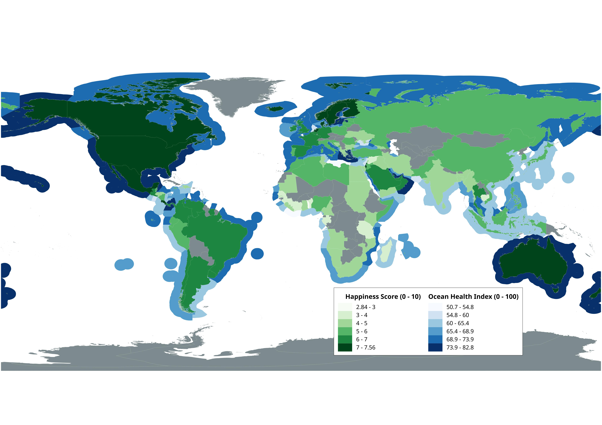

```{r setup, include=FALSE}
knitr::opts_chunk$set(echo = TRUE, warning = FALSE, message = FALSE, fig.cap = TRUE)
library(ggplot2)
library(lme4)
library(lmerTest)
library(tidyverse)
library(magrittr)
library(sjPlot)
library(sjmisc)
library(sjstats)
library(arm)
library(readr)
df <- read_csv("/home/charlie/Documents/Uni/Exeter - Data Science/MTHM601_Fundamentals_of_Applied_Data_Science/assignmentProjectv2/data/cleanData/finalTable.csv")
colours <- list(graphcol = '#315659',
                linecol =   '#253132',
                altlinecol = '#9B2915')
```

\doublespacing

# Introduction (150 words)

In a recent paper published in the Journal of Environmental Research and Public Health, Wheaton *et al*. \cite{wheaton_coastal_2021} describes the need for a better understanding of our relationship with the ocean and human wellbeing. The wellbeing benefits of being near or in the ocean have been qualitatively described on an individual or community level \cite{foley_swimming_2015, bell_seeking_2015, burdsey_race_2016} and Wuebben and Gonzalez-Trueba \cite{wuebben_surfing_2019} have identified coastal tourism as having a positive impact on human wellbeing. In addition, 2021 - 2030 has been declared by the United Nations as the 'Decade of Ocean Science for Sustainable Development' \cite{httpsplusgooglecomunesco_united_2017, wheaton_coastal_2021} which highlights how important our relationship to this ecosystem is. However, research also describes the inequity present with regards to access to the ocean, with certain socioeconomic and disadvantaged groups having less availability to the ocean than others \cite{olive_understanding_2021, phoenix_segregation_2021}. Identifying the relationship between the ocean and human wellbeing on a regional or global scale could help to reinforce the importance of protecting coastal ecosystems and help to identify where more work is needed in bringing a sense of connection to the ocean in certain areas.  Therefore, this analysis takes a more quantitative approach and aims to investigate the relationship on a more macro level by exploring how our connection with, and reliance on, the ocean may influence our happiness on a country by country basis.


# Aims and Objectives (150 words)

The aims of this analysis are to determine whether there is a significant correlation between a countries happiness and the health of the ocean that the country borders. Furthermore, it aims to identify what it is about our connection with the ocean that has the most influence on human wellbeing. To achieve these aims the following objectives need to be achieved: The first step will be to obtain data which include the required information. Since the data is likely to come from different sources, the data need to be cleaned, wrangled and merged together to form one dataset to be used for analysis. This will then allow any missing data to be identified and the appropriate method for handling these data can be applied. From here, descriptive statistics can be carried out to provide more insight into the data. With a better understanding of the features of the dataset a statistical model can then be created to identify any relationship between the features, testing different methodologies to create the most appropraite model for the data. Finally, the results of the analysis will be presented using both visual assets and model outputs followed by discussion around the significance of the results and any limitations of the methods used for analysis. For the data cleaning and wrangling, Python 3.10.2 \cite{10.5555/1593511} will be used, for the statistical analysis, R version 4.1.2 \cite{r_studio} will be used, and for the geographical presentation of the data, QGIS 3.22.3-Białowieża \cite{QGIS_software} will be used.


# Data (500 words)

For the analysis, multiple datasets were identified as appropriate sources: the Ocean Health Index (OHI) dataset and the World Happiness Report (WHR) dataset.

## Ocean Health Index

The OHI is a global assessment of 220 countries and assess the health of the ocean within each countries exclusive economic zone (EEZ). The assessment has been conducted from 2012 - 2021 and is still an ongoing project. The researchers use 10 goals and subgoals that they consider to be an import attributing factor to the health of the ocean for a country. These goals are weighted and used to calculated an overall index score for a country. A description of each goal involved in the calculation of the index score can be seen in Figure \@ref(fig:OHIGoals). In the context of the blue economy and understanding the current status of our oceans, as well as the future threats, the OHI has been beneficial is exploring the link between the indicators of ocean health and the gaps in the research where more data or analysis is need to help protect and improve the state of the global oceans \cite{halpern_building_2020}.

The data set comes in the format of a CSV file and contains an observation for each country for each goal, year and an overall index score. The goals and index are values between 0 - 100 where the index is the weighted calculations of the goals. Since the index is calculated based on the goals, the index was not used in  the analysis and instead each goal was used to determine its influence over the response variable. The data was filtered to only include 2015 - 2019 since this was the data range available in both the WHR and OHI datasets. The data also needed pivoted so that each goal was a column and to tidy the data.

```{r OHIGoals, echo=FALSE, fig.align='center', out.width='75%', fig.cap='The goals and their definitions used to calcualted the index score for each country'}
knitr::include_graphics("figures/OHIGoals.png")
```


## World Happiness Report

The WHR is a publication by the Sustainable Development Solutions Network and has been published from 2012 - 2021 (excl. 2014). The report synthesis information from the Gallup World Poll and Lloyd's Register Foundation which provides data for the World Risk Poll. The data is collected using qualitative interviews from across 142 countries with a specific focus on ensuring that data is collected in countries where there has traditionally been a lack or of or limited data. The authors of the WHR then synthesize these data add calculate an overall happiness score for each country. There are six factors used to calculate the overall happiness score: GDP per capita, social support, healthy life expectancy, freedom to make life choices, generosity and perceptions of corruption. The format of the data was such that each country had a value for each factor and an overall happiness score. Since the happiness score is a composite index and the values for each factors was the extent to which it influenced the happiness score, the happiness score was used for analysis and considered as the response variable. Each year was its own data set so for each file, a 'year' column was added and all the files were merged into one dataset.

Once a tidy version of the OHI and the WHR had been made containing data for 2015 - 2019, the two datasets needed to be joined together. This was carried out using Pandas in Python and involved some pre-processing steps. The datasets were to be joined using matching values for country and year, however some countries were not consistently named between datasets. These were identified and made consistent then the two datasets were merged. The columns were renamed and ordered in a sensible order to make analysis easier.

To make the world map in Figure \@ref(fig:WHRMap) the shape files of the OHI dataset were used. To this, the cleaned merged dataset was joined to the shape files to allow the ocean health index scores and the world happiness scores to be visualized. QGIS was used for the joining and visualization of this image.

## Missing Data

Missing data was imputed using the `sklearn` package in Python. Two algorithms were used to impute the missing data: K-nearest-neighbour (KNN) and IterativeImputer. Both of the algorithms used are multivariate imputation methods as this gives a more precise estimation than linear imputation \cite{htoon_guide_2020}. The KNN algorithm was the chosen method used to impute the missing data since it impute the missing values based on related observations \cite{beretta_nearest_2016}. A hyper-parameter of 2 was chosen for the number of neighbors as this estimated the missing values while preserving the distribution of the data. 

***Insert world maps here and maybe some graphs of imputed data or DESCRIPTIVE STATS OF DATA***

```{r WHRMap, echo=FALSE, fig.align='center', out.width='75%', fig.cap='The happiness score for each country and the ocean health index for the connected exclusive economic zone (EEZ) for that country. Darker colours represent higher scores and lighter colours represent lower scores. While the ocean health index score was not used in the analysis this gives an initial overview of the health of each countries ocean'}

```

# Analysis and Results (1500 words)

The world map in Figure \@ref(fig:WHRMap) was used to initially compare the two datasets adn to identify any possible relationship. This initial comparison shows that there is some overlap between countries having high happiness and a high ocean health index. In areas where the happiness score is high (dark green), such as Australia and New Zealand, North America, and Scandinavia, the respective EEZ also have a high ocean health index score (dark blue). Similarly in places with lower happiness scores, such as Western and Sub-Sarahan Africa, and South Asia, there seems to be a relatively low ocean index score as well.  To investigate this further a basic linear model was fitted to the data to see the relationship between the index and the happinessScore. Figure \@ref(fig:scatterIndexVHappiness) shows that there seems to be a positive correlation between the variables. To gain a better understanding of which regions have the higher happiness and ocean health index scores the data was grouped by region and the mean of the index and happiness scores were taken. Table \@ref(tab:summaryTable) are the results of this and shows that Australia and New Zealand, North America, and Western Europe have both the highest average ocean health index score and average happiness score.

```{r scatterIndexVHappiness, echo = FALSE, fig.align='center', out.width='75%', fig.cap='An initial model comparing Happiness  Index using the built stats method in ggplot2. The index feature was used here to gain an initial understanding of the relationship between ocean health and happiness however further analysis will use the goal features from the OHI as a proxy for the ocean health index.'}
df %>% ggplot(aes(x = index, y = happinessScore)) + 
  theme_bw() +
  geom_point(col = colours$graphcol) +
  stat_smooth(method = "lm", col = colours$altlinecol)
```

***Include some basic descriptive stats like average OHI for each region and WHR for each region***
```{r summaryTable, echo = FALSE}
library(knitr)
summary <- df %>%
  group_by(region) %>%
  summarize(index=round(mean(index), digits = 2), happinessScore = round(mean(happinessScore), digits = 2)) %>%
  arrange(desc(index), desc(happinessScore))


kable(summary, caption = "Mean ocean health index and happiness score for each region")
```

***Start with the relationship between sense of place (OR JUST  OHI INDEX) and world happiness as this is what I was initially interested in***

- Scatter plot of graph with model fitted
- Talk about R value and why it is low
- Maybe include plot split by region and state how this changes the relationship. Say that I will first create a model by including other varibles and then perform the heirarchical modelling to investigate the effect of region
- Initally used OHI index and happiness score but since OHI index is a composite index it was not included in the models which used the other features

***Then describe the final basic model used and present some daignostic charts***

- Compare it to the initial model

***Go into hierarchical modelling and fixed effects modelling***

- Fixed effects graph
- random effects graph
- Regression table of mixed effect model


# Limitations (300 words)

- Didn't compare the happiness difference between coastal and land locked countries (if I don't end up doing it)
- Some of the variables in the OHI data are heavy assumptions (sense of place in particular but check others)
- Talk about how there may be crossed random effects of the years due to repeated observations of each country


# Conclusion (180 words)

- Restate aims of the analysis
- Data used
- Steps taken and what they showed
- Why a simple linear model/fixed effects model overstates relationship
- How accounting for region changed this relationship#
- ***Link back to the first paper cited and how more qual research is needed***

***IF I HAVE TIME I COULD LOOK AT THE DIFFERENCE BETWEEN HAPPINESS OF COUNTRIES CONNECTED TO THE OCEAN AND NOT CONNECTED TO THE OCEAN***

\bibliography{OHIBib.bib}
\bibliographystyle{IEEEtran}