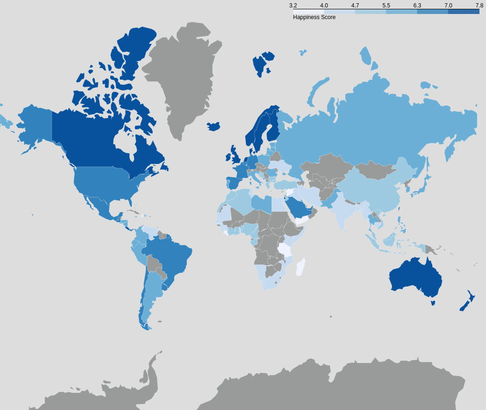
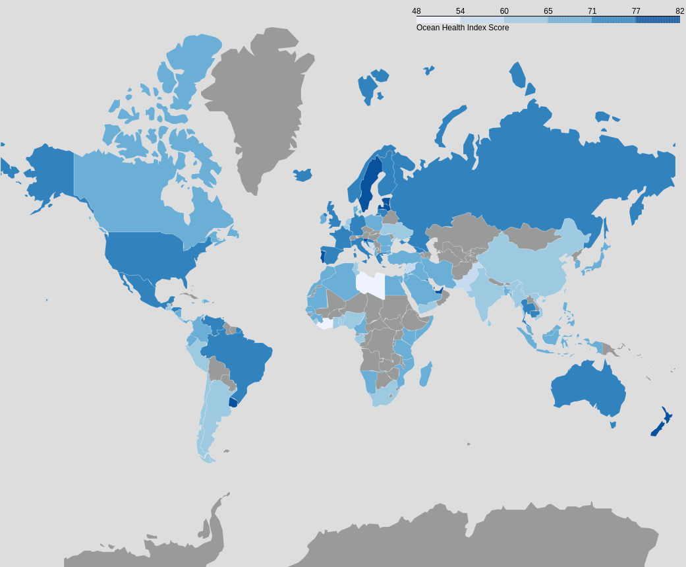

```{r setup, include=FALSE}
knitr::opts_chunk$set(echo = TRUE, warning = FALSE, message = FALSE, fig.cap = TRUE)
```

# Introduction (150 words)

In a recent paper published in the Journal of Environmental Research and Public Health, Wheaton et al., (\cite{wheaton_coastal_2021})

***Quick paragraph about how:***

- Being by the ocean improves happiness for individuals
- Ocean provides livelihood and sporting opps
- Does this benefit to the individual extend to the country level
- Are more countries connected to the ocean more than others

# Objectives (150 words)

***The objectives of this analysis are to determine whether there is a significant correlation between a countries happiness and the health of the ocean connected to the country. The steps to achieve this are to:***

- Obtain data that provides insight into each side of the problem
- Wrangle the data using python and combining to datasets and deciding what the best approach is for missing values
- Descriptive statistics will then be carried out to understand the different datasets in more depth and to begin to identify any relationships that may be apparent
- Then a statistical model will be created to best describe any relationship between the data.
- Final the results will be presented using both visual assets and model outputs and I will discuss the significance of the results within the context of this analysis

# Data (500 words)

***Brief description of data used:***

- OHI
  - What years?
  - What variables does it include?
  - Who created it?
  - What is it's significance in wider lit. i.e. is it used by UN world bodies or anything like that?
  
- WHR
  - What years?
  - Variables of interest?
  - Wider context and uses
  
- World Map data for making maps
  
***Describe what each dataset looked like (years, variables etc) and how I wrangled, tidied and merged them together***

- How I imputed missing values (used KNN with 2 neighbours (justify with literature))

***Insert world maps here and maybe some graphs of imputed data or DESCRIPTIVE STATS OF DATA***

```{r WHRMap, echo=FALSE, fig.align='center', out.width='100%', fig.cap='Map of happiness scores'}

```


```{r OHIMap, echo=FALSE, fig.align='center', out.width='50%', fig.cap='Map of ocean health index scores'}

```

# Analysis and Results (1500 words)

***Include some basic descriptive stats like average OHI for each region and WHR for each region***

***Start with the relationship between sense of place (OR JUST  OHI INDEX) and world happiness as this is what I was initially interested in***

- Scatter plot of graph with model fitted
- Talk about R value and why it is low
- Maybe include plot split by region and state how this changes the relationship. Say that I will first create a model by including other varibles and then perform the heirarchical modelling to investigate the effect of region
- Initally used OHI index and happiness score but since OHI index is a composite index it was not included in the models which used the other features

***Then describe the final basic model used and present some daignostic charts***

- Compare it to the initial model

***Go into hierarchical modelling and fixed effects modelling***

- Fixed effects graph
- random effects graph
- Regression table of mixed effect model


# Limitations (300 words)

- Didn't compare the happiness difference between coastal and land locked countries (if I don't end up doing it)
- Some of the variables in the OHI data are heavy assumptions (sense of place in particular but check others)
- Talk about how there may be crossed random effects of the years due to repeated observations of each country


# Conclusion (180 words)

- Restate aims of the analysis
- Data used
- Steps taken and what they showed
- Why a simple linear model/fixed effects model overstates relationship
- How accounting for region changed this relationship

***IF I HAVE TIME I COULD LOOK AT THE DIFFERENCE BETWEEN HAPPINESS OF COUNTRIES CONNECTED TO THE OCEAN AND NOT CONNECTED TO THE OCEAN***

\bibliography{OHIBib.bib}
\bibliographystyle{IEEEtran}